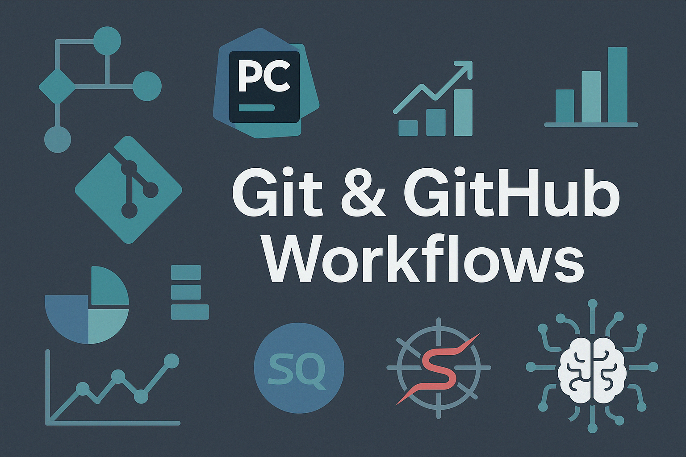

  

# 🧰 Git Workflows & Developer Guides

📚 Practical guides to mastering Git & GitHub workflows with PyCharm, terminal, and SSH.

Este repositorio contiene documentación clara y sencilla sobre cómo trabajar con Git y GitHub desde entornos de desarrollo como PyCharm, usando autenticación SSH y buenas prácticas para control de versiones.

---

## 📄 Contenido

| Archivo | Descripción |
|--------|-------------|
| [`Mini_Guia_Subida_GitHub_Desde_PyCharm.md`](Mini_Guia_Subida_GitHub_Desde_PyCharm.md) | Cómo conectar PyCharm con GitHub mediante SSH, paso a paso. |
| [`TOC_Git_Guides.md`](TOC_Git_Guides.md) | Tabla de contenidos de las guías incluidas y futuras. |

---

## 💡 ¿Por qué este repositorio?

- Para aprender Git con ejemplos reales.
- Para subir proyectos desde PyCharm sin pelearte con contraseñas.
- Para usar SSH y evitar problemas de autenticación.
- Porque documentar es clave para el desarrollo profesional ✨

---

## 👩‍💻 Autora

Creado por [**Carmen-analyst**](https://github.com/Carmen-analyst)  
Parte de su portfolio de desarrollo y análisis de datos.

---

⭐ Si te ha resultado útil, considera darle una estrella al repo o compartirlo con alguien que lo necesite.
